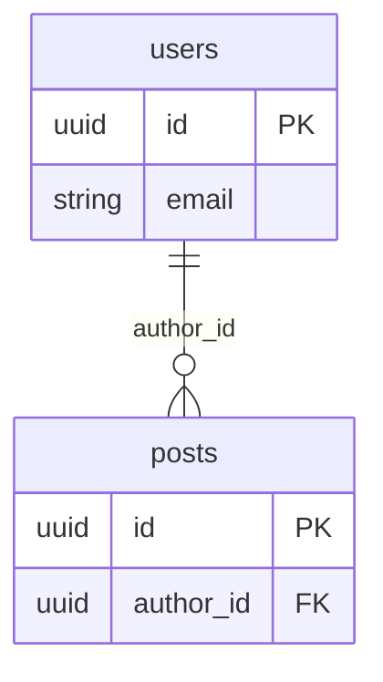

# Alter

> Comprehension first, design second.

Visual schema design for SQLModel and SQLAlchemy. Edit your database as a diagram, write it back as code.


## What is Alter?

Alter is a local-first schema tool that keeps your ORM models and a visual ERD canvas in sync — in both directions:

```
  ┌─────────────┐                       ┌───────────────┐
  │  Your Code  │  ── alter sync ─────► │    Canvas     │
  │ (models.py) │                       │ (visual ERD)  │
  │             │  ◄── alter apply ──── │               │
  └─────────────┘                       └───────────────┘
                    schema.alter
                  (keeps both in sync)
```

You design tables on the canvas, and Alter writes clean Python classes back to your files.
You edit your models by hand, and Alter updates the canvas to match.

Everything runs locally. No cloud, no account, no data leaves your machine.

## Installation

```bash
pip install alterdb
```

Or with [uv](https://docs.astral.sh/uv/):

```bash
uv add alterdb
```

**Requirements:** Python 3.11+

> **Dependency conflicts?** If `alterdb` clashes with packages already in your project, install it
> as an isolated CLI tool instead:
>
> ```bash
> uv tool install alterdb
> ```
>
> This keeps Alter's dependencies completely separate from your project's virtual environment while
> making the `alter` command available on your `PATH`.

> **Live database introspection** (MCP `introspect_db` tool): requires `psycopg2-binary`, install with `pip install alterdb[db]`.

## Quick Start

### From existing models

```bash
alter init      # scan your ORM models → create schema.alter
alter canvas    # open the visual ERD in your browser
```

Your browser opens with an interactive diagram of every table, column, and relation in your project.

### From an existing database

Export your database schema as SQL, then import it:

```bash
pg_dump --schema-only --no-owner mydb > schema.sql
alter import schema.sql     # parse DDL and merge tables into schema.alter
alter canvas                # open the visual editor
```

Or start the canvas first and use **Paste SQL** in the toolbar to paste your DDL directly.

### Starting from scratch

No models yet? Start with a blank canvas or one of the built-in templates:

```bash
alter init      # creates an empty schema.alter
alter canvas    # open the canvas, click "Templates" to pick a starter
```

Choose from **saas-base**, **auth**, **cms**, or **ecommerce** — tables are proposed on the canvas
so you can review and customize before committing anything.

## What is `schema.alter`?

`schema.alter` is a JSON file that captures your table definitions, column types, relations, and
canvas layout positions. It sits between your Python code and the visual editor — a single source
of truth that's human-readable, git-diffable, and lives in your repo.

Think of it as a `.lock` file for your database schema, except you can open it in a browser and
edit it visually.

A minimal example:

```json
{
  "version": 1,
  "orm": "sqlmodel",
  "tables": [
    {
      "name": "users",
      "file_path": "app/models.py",
      "position": { "x": 0, "y": 0 },
      "columns": [
        { "name": "id",    "type": "uuid",   "primary_key": true,  "default": "uuid4" },
        { "name": "email", "type": "string", "nullable": false,    "unique": true     },
        { "name": "name",  "type": "string", "nullable": false                        }
      ]
    }
  ]
}
```

## The Two-Way Workflow

Two commands keep `schema.alter` synchronized with your code:

### Canvas → Code

You add a table or modify a column on the canvas, then click **Commit** (or use the in-canvas
**Apply to Code** button), or run from the terminal:

```bash
alter apply --preview   # see exactly what will change (unified diff)
alter apply             # write the changes to your model files
```

`alter apply` is surgical — it only modifies the classes that changed. Your docstrings,
`Relationship()` definitions, trailing inline comments, hand-written `Field()` kwarg order,
and mutable defaults written as `default={}` or `default=[]` are all preserved verbatim.

For example, drawing a `Payment` table on the canvas and clicking **Commit** writes this to
`app/models.py`:

```python
import uuid
from sqlmodel import Field, SQLModel


class Payment(SQLModel, table=True):
    __tablename__ = "payments"

    id: uuid.UUID = Field(default_factory=uuid.uuid4, primary_key=True)
    amount: int
    currency: str = Field(max_length=3)
    user_id: uuid.UUID = Field(foreign_key="users.id")
```

Enum changes are written to the correct file: if `Role` is defined in `app/enums.py`, edits on
the canvas update `app/enums.py` — not your model file.

### Code → Canvas

You edit `models.py` by hand, then click the in-canvas **Sync from Code** button, or run:

```bash
alter sync    # re-parse your models, update schema.alter
```

The canvas picks up the change automatically via live reload — no restart needed.

### Preview changes before committing

```bash
alter diff                    # see what changed (text)
alter diff --format markdown  # PR-ready changelog
```

## Complete Workflow Example

Here's the full story, from a fresh project to running migrations:

```bash
# 1. Initialise
alter init                            # scan models → schema.alter

# 2. Create the initial migration (one-time, with your migration manager)
#    Example with Alembic — see Migrations section below
alembic init alembic
alembic revision --autogenerate -m "initial schema"
alembic upgrade head                  # create tables in the database

# 3. Open the canvas and make changes
alter canvas

# — design on the canvas —
# add a "payments" table, click Commit
# the "Migrations" tab shows the SQL that needs to run

# 4. Apply canvas changes to code
alter apply --preview                 # see the unified diff
alter apply                           # write class Payments to models.py

# 5. Run the migration with your own tooling
#    Copy the SQL from the canvas Migrations tab, then:
alembic revision -m "add payments table"   # create revision file
# paste the SQL into the upgrade() function
alembic upgrade head
```

## Migrations

Alter generates the SQL — you run it with whatever migration tool you already use.

The **Migrations tab** in the canvas shows the pending SQL at any time. The `preview_migration`
MCP tool returns the same SQL to AI assistants. Copy it into your migration manager of choice.

### With Alembic (one-time setup)

```bash
alembic init alembic    # creates alembic.ini + alembic/env.py + alembic/versions/
```

Edit `alembic/env.py` so Alembic knows about your models:

```python
from sqlmodel import SQLModel
import app.models  # ensure all models are imported and registered

target_metadata = SQLModel.metadata   # required for autogenerate
```

### Initial migration

Create all tables from scratch:

```bash
alembic revision --autogenerate -m "initial schema"
alembic upgrade head
```

### Incremental migrations (canvas or MCP driven)

After the initial migration, use the canvas Migrations tab to see the SQL for any canvas
or MCP change, then apply it with your tool:

```bash
# 1. Make changes on the canvas or via MCP
# 2. See the SQL in the canvas Migrations tab (or call preview_migration via MCP)
# 3. Create and apply the migration:
alembic revision -m "add payments table"   # create an empty revision
# paste the SQL into upgrade() in the new file
alembic upgrade head
```

> **With other tools** (Django, Flyway, raw SQL, etc.) — the workflow is the same: copy the
> SQL from the canvas Migrations tab and apply it however your project requires.

## Adding a File to an Existing Schema

Got a legacy module or a new plugin with its own models? Add it without touching your main schema:

```bash
alter add app/legacy/models.py        # parse and merge new tables into schema.alter
alter add lib/plugins/billing.py      # tables already in the schema are skipped
```

`alter add` parses the file, adds any new tables (and their enum types), and saves `schema.alter`.
Already-tracked tables are silently skipped — safe to run multiple times.

## PostgreSQL Schema Support

Tables in a non-default PostgreSQL schema (i.e. with a `__table_args__ = {"schema": "..."}` entry) are fully supported end-to-end:

- **Parsing** — both `{"schema": "billing"}` dict form and the tuple form `({"schema": "billing"}, UniqueConstraint(...))` are recognised.
- **SQL export** — `CREATE TABLE` headers and `REFERENCES` clauses use the qualified `schema.table` name.
- **Mermaid export** — entity names use `schema_table` (underscore-joined) for valid Mermaid identifiers; relation lines follow the same convention.
- **Validation** — foreign keys may be written as `table.column` or `schema.table.column`.

## Cross-File Support

Alter understands multi-file projects out of the box:

- **Enums in separate files** — if `Role` is defined in `app/enums.py`, Alter tracks its
  `file_path` so that `alter apply` never duplicates the enum class in your model file.
- **Base class inheritance** — columns inherited from mixin classes (e.g. `UUIDBase`,
  `TimestampedBase`) are tracked as inherited and never re-injected as explicit field definitions
  when applying to code.
- **Multi-file models** — tables can live in different files; `alter apply` writes each table to
  the correct file independently.

## Enums on the Canvas

Enums are displayed on the canvas as read-only reference cards showing each enum's name and
values. This lets you see which types are available when wiring up columns, but **enums cannot
be added, edited, or deleted from the canvas** — the source file is the single source of truth.

To add or change an enum, edit the source file directly (e.g. `app/enums.py`), then sync:

```bash
alter sync          # re-parse models → refresh schema.alter
```

Or click **Sync from Code** in the canvas toolbar. The updated enum appears immediately.

## Templates

Alter ships four starter templates, accessible from the **Templates** button in the canvas
toolbar or via the CLI:

| Template    | Tables                                      |
| ----------- | ------------------------------------------- |
| `saas-base` | users, organizations, memberships, sessions |
| `auth`      | users, sessions, tokens, oauth_accounts     |
| `cms`       | posts, categories, tags, media              |
| `ecommerce` | products, orders, order_items, customers    |

Import a template into an existing project:

```bash
alter import templates/ecommerce.alter
```

Tables already in your schema are skipped — no duplicates.

## Commands

### Quick reference

| Command              | What it does                                                  |
| -------------------- | ------------------------------------------------------------- |
| `alter init`         | Create `schema.alter` from existing ORM model files           |
| `alter canvas`       | Open the interactive ERD in your browser                      |
| `alter apply`        | Write schema changes to your ORM model files                  |
| `alter sync`         | Update `schema.alter` from your ORM model files               |
| `alter add`          | Add tables from a model file to the schema                    |
| `alter diff`         | Show pending changes between schema and code                  |
| `alter validate`     | Check your schema for errors and warnings                     |
| `alter export`       | Export as SQL DDL, Mermaid ERD, or `.alter` JSON              |
| `alter import`       | Import tables from a `.sql` or `.alter` file                  |
| `alter merge-driver` | Git merge driver for `.alter` files                           |
| `alter mcp`          | Start the MCP server                                          |

### `alter diff`

Compare `schema.alter` with your ORM model files and show what has drifted:

```bash
alter diff                      # text summary (+ added, ~ modified, - removed)
alter diff --format markdown    # PR-ready markdown changelog
```

Useful before committing code changes or before opening a PR to make sure the
canvas and the code are still in sync. Exits non-zero if there are differences.

### `alter validate`

Check the schema for structural problems before applying or exporting:

```bash
alter validate
```

Reports errors (broken FK references, duplicate table names, unsupported type
combinations), warnings, and info-level hints. Exits with code 1 if any errors
are found — safe to use in CI.

Foreign key references can be written as `table.column` or `schema.table.column`
for tables in a non-default PostgreSQL schema.

### `alter export`

Export the committed schema in different formats:

```bash
alter export                              # SQL DDL to stdout (default)
alter export --format mermaid             # Mermaid ERD diagram to stdout
alter export --format alter               # raw schema.alter JSON to stdout
alter export --output schema.sql          # write to a file instead of stdout
alter export --format mermaid --output erd.md   # write Mermaid to a file
alter export --proposed                   # export staged (uncommitted) changes
```

The Mermaid output can be pasted directly into GitHub Markdown, Notion, or any
tool that renders ```` ```mermaid ```` fences:

````markdown

````

### `alter import`

Merge tables from an external source into `schema.alter`. Tables already present
are skipped — safe to run multiple times:

```bash
alter import schema.sql             # import from a pg_dump or hand-written DDL
alter import other.alter            # import from another schema.alter file
alter import templates/saas.alter   # import a built-in template
```

Format is auto-detected from the file extension (`.sql` or `.alter`). You can
also override it with `--format sql` or `--format alter`.

### `alter merge-driver`

A custom Git merge driver that merges `schema.alter` files structurally (by
table name) instead of line-by-line, which eliminates most merge conflicts when
two branches add different tables.

**One-time setup** (run once per machine):

```bash
git config --global merge.alter.name   "Alter schema merge driver"
git config --global merge.alter.driver "alter merge-driver %O %A %B"
```

Then add to your repo's `.gitattributes`:

```
*.alter merge=alter
```

After that, Git uses the driver automatically whenever a `.alter` file is
involved in a merge or rebase. No further action needed.

## MCP Server

Alter exposes your schema to any MCP-compatible AI assistant (Claude Code, Cursor, Windsurf, etc.)
so it can read, modify, and commit schema changes programmatically — all through natural language.

### Setup

**Step 1 — Initialize the schema file** (if you haven't already):

```bash
alter init    # scan your ORM models → create schema.alter
```

The MCP server requires `schema.alter` to exist before it can start.

**Step 2 — Register the server in your editor.**

Most editors use the same JSON config. Add this to your MCP settings file:

```json
{
  "mcpServers": {
    "alter": {
      "command": "uv",
      "args": ["run", "--directory", "/path/to/project", "alter", "mcp"]
    }
  }
}
```

Replace `/path/to/project` with the absolute path to your project root.

| Editor | Config file |
| --- | --- |
| Claude Desktop | `claude_desktop_config.json` |
| Cursor | `.cursor/mcp.json` |
| Windsurf | `.windsurf/mcp.json` |

For **Claude Code**, you can also register via the CLI instead of editing JSON:

```bash
claude mcp add alter -- uv run --directory /path/to/project alter mcp
```

> **Why `uv run`?** It ensures the command runs inside your project's virtual environment,
> picking up the correct `alterdb` version and dependencies — no manual `source .venv/bin/activate` needed.

**Step 3 — Restart your editor** (or open a new session) so the MCP server connects. Verify by asking:

> _"What tools do you have available from alter?"_

### What AI assistants can do through MCP

- **Read** your current schema (tables, columns, relations, enums)
- **Propose changes** — add/remove/rename tables and columns in a staging area
- **Add a file** — parse a model file and merge its tables into the schema
- **Preview diffs** before committing anything
- **Preview migration SQL** — see the DDL that needs to run for pending changes
- **Undo/redo** any staged change
- **Commit** approved changes to `schema.alter`
- **Export** as SQL, Mermaid, or JSON
- **Validate** the schema for errors

### Example prompts

Once connected, just talk to your assistant:

**Explore and understand:**
- _"Show me the current schema"_
- _"What tables reference the users table?"_
- _"How many columns does the orders table have? List them with their types"_
- _"Export the schema as a Mermaid diagram I can paste into our wiki"_

**Design and modify:**
- _"Add a `payments` table with `id`, `amount`, `currency`, and a foreign key to `users`"_
- _"Add a `tags` table and a many-to-many join table linking it to `posts`"_
- _"Rename the `name` column in `users` to `full_name`"_
- _"Add `created_at` and `updated_at` timestamp columns to every table"_
- _"Remove the `legacy_notes` column from `orders`"_

**Review and validate:**
- _"Show me the diff of what changed"_
- _"Preview the migration SQL for the pending changes"_
- _"Validate the schema — are there any broken foreign keys?"_
- _"Undo the last change"_

**Import and bootstrap:**
- _"Parse `app/legacy/models.py` and add its tables to the schema"_
- _"I have a SQL dump — import it into the schema"_

The assistant stages changes, shows you a diff, and only commits to `schema.alter` with your
approval — nothing is written to your model files until you also run `alter apply`.

## Supported ORMs

- **SQLModel** — auto-detected from `from sqlmodel import ...`
- **SQLAlchemy 2.0** (declarative) — auto-detected from `from sqlalchemy import ...`

## License

MIT
